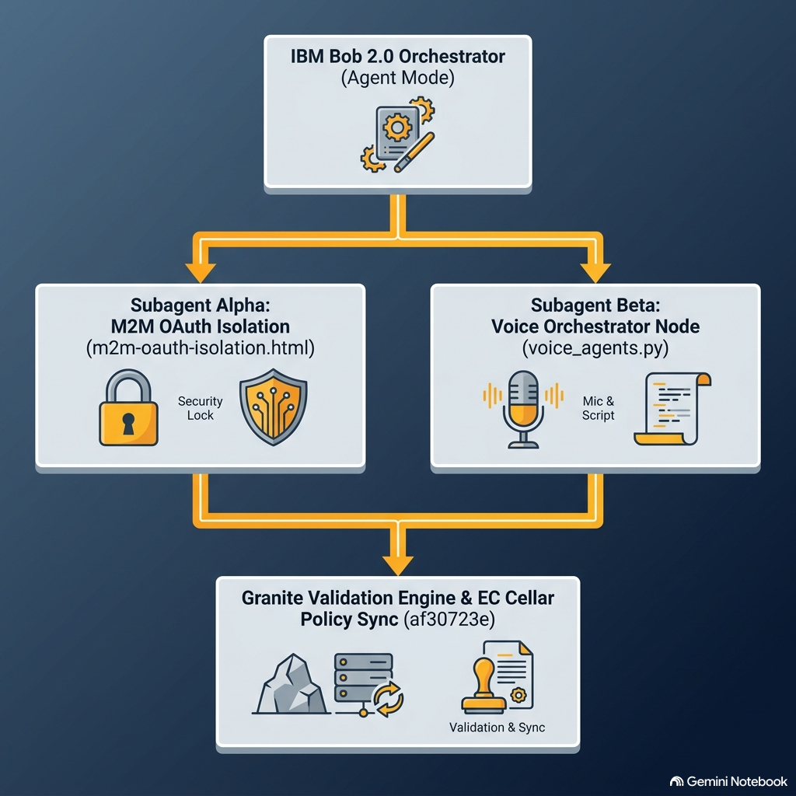

# VANE-SPACE-SLA (v1.0) 🛰️

**Deterministic Multi-Gate Telemetry Validation & Strict Prompt Grounding Toolkit**  
*Demonstration / Portfolio Project*

A lightweight, self-contained Python toolkit that demonstrates multi-gate telemetry validation and strict prompt grounding concepts.  
All external AI and infrastructure services are **intentionally simulated** so the project remains fully runnable without any paid or external dependencies.

---

### Live Site 
- Github Pages: [https://anticipatedd.github.io/VANE-SPACE-SLA](https://anticipatedd.github.io/VANE-SPACE-SLA/)



---

## What This Project Actually Does

- Simulates multi-gate telemetry validation
- Provides a strict / moderate / soft prompt grounding builder
- Uses environment variables (no hardcoded secrets)
- Includes structured logging
- Comes with a complete pytest test suite
- Has GitHub Actions CI

This is **not** a production RAG system, and it does **not** call real IBM watsonx, Milvus, FAISS, Redis, or PostgreSQL services.

---

## Quick Start

```bash
git clone https://github.com/AnticipatedD/VANE-SPACE-SLA.git
cd VANE-SPACE-SLA
python -m venv .venv
source .venv/bin/activate          # Windows: .venv\Scripts\activate
pip install -r requirements.txt
cp .env.example .env
pytest --cov=. --cov-report=term
python vane_space_init.py
```
---

## Project Structure

VANE-SPACE-SLA/
├── vane_space_init.py
├── strict_prompt_builder.py
├── requirements.txt
├── .env.example
├── .github/workflows/ci.yml
├── tests/
│   ├── test_vane_space_init.py
│   └── test_strict_prompt_builder.py
└── README.md

---

## Author

**MD ABUL HOSSAIN**  
IBM Business Partner Plus. 
European F&T Expert ID: EX2026D1473148. 
Web of Science ResearcherID: QQZ-6739-2026. 
ORCID: 0009-0004-4378-5298. 
[Microsoft Learn](https://learn.microsoft.com/en-us/users/mdabulhossain-6486/) Level 10 (90 badges, 17 trophies)

---

## License
[MIT License](license.md)

### Alerts
Alerts, also sometimes known as callouts or admonitions, are a Markdown extension based on the blockquote syntax that you can use to emphasize critical information. On GitHub, they are displayed with distinctive colors and icons to indicate the significance of the content.

Use alerts only when they are crucial for user success and limit them to one or two per article to prevent overloading the reader. Additionally, you should avoid placing alerts consecutively. Alerts cannot be nested within other elements.

To add an alert, use a special blockquote line specifying the alert type, followed by the alert information in a standard blockquote. Five types of alerts are available:

> [!NOTE]
> Useful information that users should know, even when skimming content.

> [!TIP]
> Helpful advice for doing things better or more easily.

> [!IMPORTANT]
> Key information users need to know to achieve their goal.

> [!WARNING]
> Urgent info that needs immediate user attention to avoid problems.

> [!CAUTION]
> Advises about risks or negative outcomes of certain actions.. 

---
© 2026 MD ABUL HOSSAIN. All Rights Reserved
